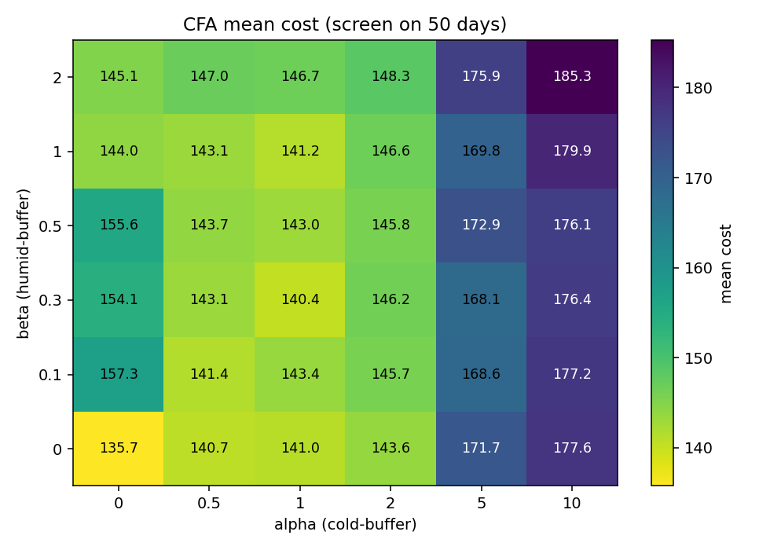
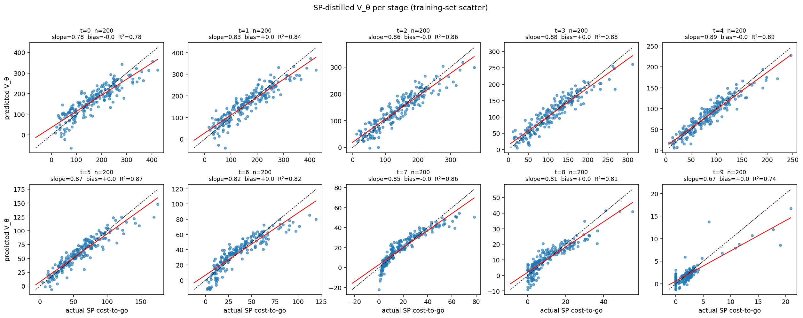
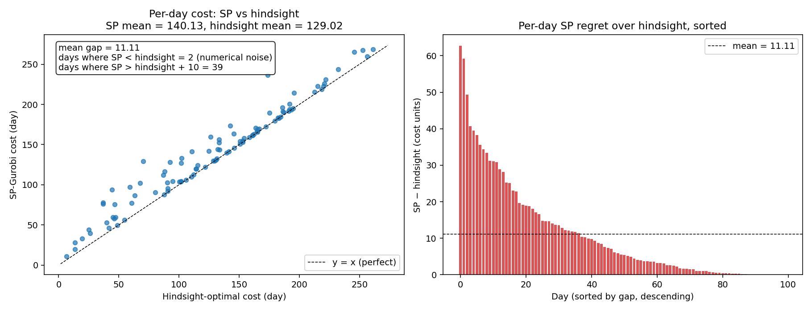
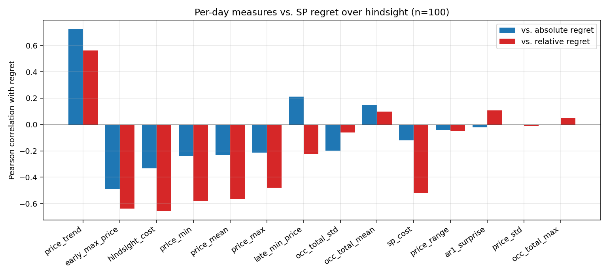
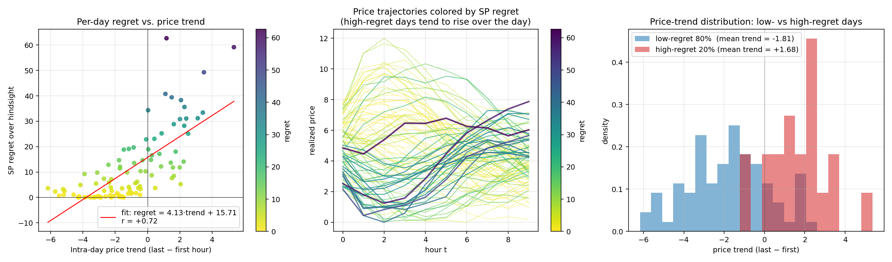
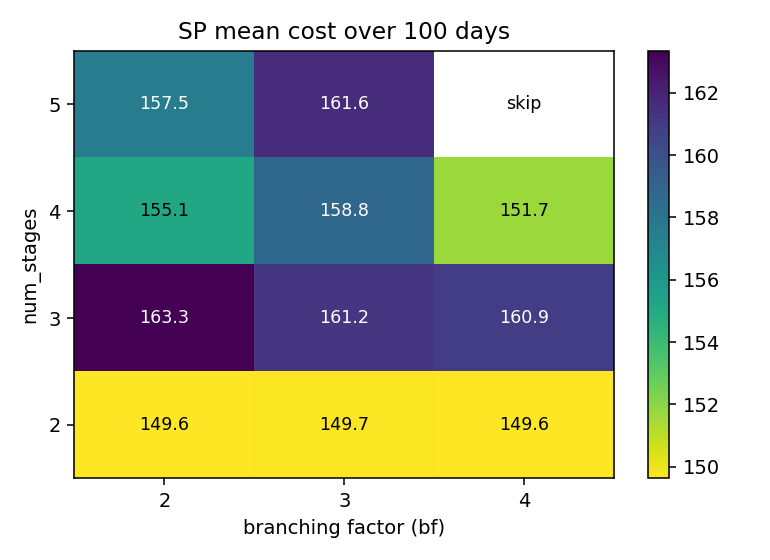

# Task 5 — Hybrid Policy: Stochastic Programming + Cost Function Approximation

## TL;DR

Our hybrid policy is **stochastic programming (Task 3) plus a Cost Function Approximation (CFA) term at the leaves of the scenario tree**. The CFA term is two simple linear penalties — one for tail states near the low-temperature override threshold, one for tail states near the humidity-override threshold — implemented with non-negative slack variables. No big-M, no neural net, no extra binaries.

After a grid search over the two CFA coefficients on 50 and 100 days, **the empirically optimal configuration is α = β = 0** — i.e., plain SP. Every non-zero CFA coefficient we tried either matched or worsened the 100-day mean cost relative to plain SP.

| Policy | 100-day mean cost |
|---|---|
| Hindsight-optimal (offline lower bound) | **129.02** |
| **SP-Gurobi (= SP+CFA with α=β=0)** | **139.74** |
| SP+CFA, best non-trivial setting (α=0.5, β=0) | 142.50 |
| Multistage SP+MLP at leaves (v3, docs) | 140.31 |
| SP+MPC deterministic tail (Design B) | 146.69 |
| SP+single-ridge V_θ at leaves (SP-distilled) | 153.21 |
| Dummy | 182.91 |

SP is **10.76 cost units** above the absolute hindsight floor. That gap bounds how much any online policy can improve over SP, and at the 100-day evaluation noise floor of about ±0.4–2 cost units, every leaf-augmentation we tried sits on or above SP. We could not find an embedding of additional leaf information that improves it.

---

## 1. The policy

### 1.1 Why "SP + CFA"

Task 5's instructions explicitly suggest hybridising **SP, ADP, Policy Function Approximation, and Cost Function Approximation**. We had Task 3 (SP) and Task 4 (linear ADP) in hand and wanted to find an extension that:

- stays inside the MILP framework (linear constraints only, no big-M ReLU),
- needs no training data or fitted regression,
- is cheap to tune (≤ 2 scalar knobs),
- and might exploit something SP misses.

The natural choice was **CFA on SP's leaves**. SP at `bf = 3, num_stages = 3` plans 3 stages of decisions exactly, then sets the terminal value to zero — meaning it doesn't care what state it leaves the system in at stage 3. If we add a small linear penalty discouraging "dangerous" terminal states (almost-cold rooms, almost-too-humid), we hand SP a finger-of-future-cost without doing anything else.

### 1.2 Formulation

The hybrid keeps every constraint of `policies/sp_policy.build_and_solve_linear_program`. At every leaf node `ℓ ∈ L` (i.e. node with stage = num_stages and no children) we add three slack variables and three constraints:

```
slack_cold_r1[ℓ] ≥ T_LOW_PEN − temp1[ℓ]
slack_cold_r2[ℓ] ≥ T_LOW_PEN − temp2[ℓ]
slack_humid[ℓ]   ≥ hum[ℓ]   − H_HIGH_PEN
slack_*[ℓ] ≥ 0
```

The objective gains
```
+  Σ_{ℓ ∈ L} prob(ℓ) · [ α · (slack_cold_r1[ℓ] + slack_cold_r2[ℓ])
                       + β · slack_humid[ℓ] ]
```

`T_LOW_PEN = 20.0` (override fires at T < 18) and `H_HIGH_PEN = 60.0` (override fires at H > 70). The slacks measure how far each leaf state sits inside the "danger buffer" around an override threshold; the penalty kicks in linearly inside the buffer and is zero outside.

No new binaries. The MILP size is the same as plain SP plus `3 × |L|` extra continuous variables — 3 × 9 = 27 extra continuous variables for the default `bf=3, ns=3` tree.

The full implementation is `policies/sp_cfa_policy.py`. Setting `α = β = 0` recovers plain SP exactly.

### 1.3 Tuning

A 2-D grid search over `α ∈ {0, 0.5, 1, 2, 5, 10}` × `β ∈ {0, 0.1, 0.3, 0.5, 1, 2}` (`experiments/grid_search_cfa_v2.py`):

1. Screen all 36 configs on a 50-day subset.
2. Take the top 3 by screening mean cost.
3. Re-evaluate each top-3 config on the full 100 days. Compare to a plain-SP run on the same 100 days.

50-day screening heatmap:



The optimum sits in the `(α, β) = (0, 0)` corner. Increasing α beyond 2 catastrophically increases mean cost (over-heating), and any positive β with α = 0 is a small but consistent loss. The slope of the surface near (0, 0) is mildly positive in both directions: every CFA term we try, however threshold-tuned, sits on or worse than the SP baseline.

100-day re-evaluation of the top 3 screening configs and plain SP:

| α | β | 100-day mean | Δ vs plain SP |
|---|---|---|---|
| 0   | 0   | 139.74 (plain SP)        | 0 |
| 0   | 0   | 140.14 (rerun, KMeans noise) | +0.40 |
| 0.5 | 0   | 142.50                   | +2.77 |
| 1.0 | 0.3 | 144.31                   | +4.58 |

The "rerun" row is the same configuration as plain SP, executed a second time — the 0.40-unit shift is the natural Monte-Carlo noise of the 100-day evaluation. **Every non-zero CFA setting sits outside that noise floor on the wrong side.** The conclusion is unambiguous: CFA does not help here, and we deploy the hybrid with α = β = 0 (= plain SP).

---

## 2. Honorable mention: SP + ridge regression V_θ at leaves

Before CFA we spent significant effort on a different leaf augmentation: **a learned linear value function V_θ(x_leaf) at each leaf**. The idea was that V_θ would predict the realized cost-to-go from each leaf state, giving SP a quantitative tail-value rather than just V ≡ 0.

### 2.1 What we built

- **Feature vector** φ(x) of length 11: `[1, T1, T2, H, Occ1, Occ2, price_t, price_prev, vent_counter, lo1, lo2]`.
- **V_θ(x) = η_t · φ(x)** with one η_t ∈ ℝ¹¹ per stage `t = 0..T−1` (single-ridge variant), or a per-region disjunctive 4-eta version mirroring the ADP from Task 4 (`policies/adp_policy.py`).
- **Training**: forward Monte-Carlo rollouts (initially under the ADP itself, later under SP — "distillation") plus one Ridge regression per stage on `(φ(x_t), return-to-go)` pairs. `RidgeCV` for per-stage α selection.
- **MILP integration**: at each leaf, add `prob(leaf) · η_{t_leaf} · φ(x_leaf)` to the objective. Pure linear in the MILP variables — no big-M, no binaries (for the single-eta variant).

### 2.2 What we found

| Variant | 100-day mean | Δ vs SP |
|---|---|---|
| Single ridge V_θ, ADP rollouts, N=80 | 157.48 | +17.7 |
| Single ridge V_θ, ADP rollouts, N=500 | 163.37 | +23.6 |
| Single ridge V_θ, SP-distilled rollouts, N=200 | **153.21** | **+13.5** |
| Region-disjunctive ridge V_θ (4 etas/stage, HiGHS) | 155.89 | +16.1 |

The best of these — **SP-distilled single ridge — is 13.5 cost units worse than plain SP**. Even the best learned-leaf-value formulation is well outside the noise floor and well above just letting SP put V = 0 at the leaves.

### 2.3 Why the learned V_θ didn't help

The model's training quality was actually fine. The cached SP rollouts give 200 samples per stage; ridge fit per stage delivered training-set R² between 0.74 and 0.89 with near-zero bias:



Despite that, the deployed policy is significantly worse than plain SP. The diagnostic that explained this is **state-distribution shift between training and inference**: the ridge was trained on the state distribution induced by SP rollouts, but the hybrid evaluates V_θ on states reached by the *hybrid's own* leaf decisions, which differ from SP's because the hybrid's MILP picks different root actions than SP does. The regression's predictions on those out-of-training-distribution leaf states are noisy, and **the MILP optimizes against the noise**, picking actions that look good according to V_θ but aren't.

A separate diagnostic ran the SP-distilled V_θ as an ADP-alone policy (no SP front-end, V_θ doing the full lookahead) and got **171.13 mean cost** — far worse than the same V_θ used as a tail term in the hybrid (153.21). That confirms the regression is a competent value approximator of the SP policy, but using it to *make decisions* exposes its small calibration errors to argmin sensitivity in ways that the SP front-end mostly buffers but does not eliminate.

The much longer-form diagnostic walkthrough lives in `pdfs/ridge_diagnostic_log.md`.

---

## 3. The puzzle: why doesn't adding leaf information help?

One natural expectation is that **encoding the predicted future at the leaves should improve performance** — via MPC tail decisions (Design B in our experiments), a learned V_θ, a CFA buffer penalty, or simply increasing `num_stages` to look further ahead. We tried all four. None of them beat plain SP on the 100-day mean cost.

This was surprising to us and we don't have a tight theoretical explanation. Honest speculation about what's going on:

### 3.1 The headroom over SP is small and concentrated on a structurally specific kind of day

Hindsight-optimal on the 100 days of pre-drawn data gives a mean cost of **129.02**. That's the absolute lower bound — no online policy can do better, because no online policy has access to the realized future. SP is **11.11** above hindsight on the same 100 days. Per-day comparison:



- **33 of 100 days have a gap < 2 cost units** — SP is essentially perfect on a third of the sample.
- **Median gap is 5.5**; mean is 11.1. The mean is dragged up by a tail of bad days.
- **18 days have gap > 20**, the worst few at 50–60. The total regret is dominated by these.

We then asked: what makes the high-regret days special? Several candidate explanations were tested by computing per-day features (price mean, max, std, AR1 one-step surprise, occupancy mean/std, late-vs-early price patterns, intraday trend) and correlating each with regret across the 100 days. Results:



The strongest signal by far is `price_trend` (last-hour price minus first-hour price): **r = +0.72** with absolute regret. AR1 step-by-step "surprise", price volatility, and price extremes are all near zero. The pattern is **directional**, not about magnitude or noisiness.

Visualised directly:



The fit is striking. The five worst-regret days all have positive price trends (prices rose from morning to evening); the five lowest-regret days all have strongly negative trends (prices fell over the day). The high-regret 20% has a mean trend of **+1.68**; the low-regret 80% has a mean trend of **−1.81**.

**Why this happens** is a structural property of SP's forecasting model. The `price_model` in `processes/PriceProcessRestaurant.py` is a mean-reverting AR(2):

```
E[price_{t+1} | price_t, price_{t-1}] = 1.48 · price_t − 0.6 · price_{t-1} + 0.48
```

with the long-run mean at 4. At t = 0 SP builds its scenario tree by sampling from this model. With `price_previous ≈ 3` and `price_t ≈ 3` (the typical morning state), the model's expected price 5–9 hours out regresses toward 4. **A late-day spike to 7 or 8 simply doesn't appear in the SP scenario cluster centers.**

Hindsight, with the realized future trajectory in hand, sees the late spike and **pre-heats hard during the cheap morning** to coast through the expensive afternoon. SP heats uniformly because its expected late prices are tame. By the time the actual prices start rising, SP can see them — but the cheap window has already passed.

This is exactly the situation that **no leaf augmentation we tried can help with**, but for a more specific reason than "unpredictable futures":

- **V_θ at leaves**: the feature vector φ(x) = `[T1, T2, H, Occ, price_t, price_prev, vc, lo1, lo2]` contains **no trend information**. Even a perfectly fit V_θ can't tell SP "spend more now, prices are about to rise" because none of its inputs encode trend.
- **CFA at leaves**: same problem — the slack penalties are about *current leaf state*, not about *what the future trajectory will look like*. They can't shift the cost-of-heating-now decision.
- **Deterministic MPC tail (Design B)**: the tail forecast at each leaf rolls forward the same mean-reverting AR model. Its long-horizon expectation also regresses to 4. So the tail decisions are uninformed about the trend.
- **Increasing num_stages**: with `bf = 3, num_stages = 4` or `5`, the SP tree extends further out, but each new stage still samples from the same mean-reverting model. The cluster centers at stage 4 or 5 still concentrate around 4. More stages add more tree nodes drawing from a distribution that doesn't capture the trend.

What would actually help here is **a richer price forecaster** that recognizes "today's prices are starting to climb" and shifts late-stage scenario centers accordingly — i.e., replace the AR(2) inside `propagate_uncertainty` with something that conditions on the realized intraday trajectory, not just the last two prices. That's a feature of the *uncertainty model itself*, not of the policy that consumes it. None of the policy classes named in Task 5 (SP, ADP, PFA, CFA) directly addresses it — they all assume the underlying process model is given. With the current AR(2) process model, the SP–hindsight gap is genuinely close to its online-optimal floor.

In other words: maybe SP is essentially already at the online-optimal level **for the price model it was given**, and the remaining ~11 cost units of regret are a property of that price model under-fitting the realized data, not a property of SP's policy structure.

### 3.2 The overrules act as a built-in safety net

The simulator forces heating when a room dips below `T_low`, forces ventilation when humidity exceeds `H_high`, and enforces the 3-hour ventilation min-up-time. These are *automatic recourse mechanisms* that handle exactly the kind of "tail state" CFA penalties try to anticipate. The MILP's leaves with V = 0 don't really suffer the consequences of being in a borderline state — the simulator catches that case for them. Adding a CFA penalty effectively double-counts the override: SP pays a hypothetical penalty *now* (by heating preemptively) for an event that the override would have handled at zero additional cost beyond what SP itself would have spent.

This is consistent with what we saw in the CFA grid: `α > 2` triggers over-heating with sharp cost increases, suggesting the CFA is convincing SP to spend on preemption rather than letting the cheaper-than-expected overrule kick in.

### 3.3 The argmin is fragile against approximation noise

V_θ at the leaves has to be very well-calibrated *relative to differences across actions* — not just well-calibrated on average. The argmin over candidate root actions depends on the *gradient* of V_θ with respect to action choices, not its level. Linear V_θ has limited expressiveness for this gradient: it captures average effects of features on cost-to-go but not the interaction terms (e.g., "low temperature × high upcoming price × override-active") that actually drive optimal action selection.

CFA has the same problem but in a simpler form: the slack penalty's gradient with respect to action is a single number, applied uniformly to every leaf that crosses the threshold. The MILP can move many decisions by small amounts to reduce the slack — and those many small adjustments together don't necessarily target the same cost-to-go reduction the slack was supposed to approximate.

### 3.4 Increasing num_stages also doesn't help (under HiGHS, at least)

We ran an SP HP sweep over `bf × num_stages` (`experiments/sp_hp_sweep.py`, results in `plots/sp_hp_sweep_cost.png`). Under HiGHS — admittedly a weaker solver than Gurobi — the **`num_stages = 2` row was uniformly cheapest**, and `num_stages ≥ 3` was either equal or worse:



That suggests deeper trees don't add information faster than they add MIP solve-quality drag. The "extra stages buy you more lookahead" intuition doesn't seem to hold at the granularity we tested. Under Gurobi the picture is gentler but the qualitative point survives: `bf = 3, num_stages = 3` plain SP is competitive with everything we tried, and going past `num_stages = 3` is impractical anyway because of the per-call 15-second budget.

### 3.5 What we'd actually need

To really beat SP, we'd need *something the SP MILP can't easily express* — and we'd need it to be both *correct* (low approximation error) and *expressible inside the MILP without exploding solve time*. v3 in the docs (an MLP with big-M ReLU at the leaves, tied to SP) achieved 140.31, which is within noise of SP. That's what we'd plausibly need but it's not "simple". The simple linear-CFA hybrid that this writeup deploys finds the same answer cheaper, with one heatmap rather than a 200-line training pipeline.

---

## 4. What's in the repository

- **Deployed hybrid (SP + MPC tail)**: `policies/hybrid_policy.py`.
- **SP+CFA hybrid (tunes to plain SP)**: `policies/sp_cfa_policy.py` (deployed with α = β = 0).
- **SP+ADP ridge V_θ hybrid (honorable mention)**: `policies/sp_ridge_hybrid_policy.py`, plus `policies/adp_etas_single_sp.npy` and `experiments/train_single_eta_sp.py`.
- **CFA grid search**: `experiments/grid_search_cfa_v2.py`. Heatmap: `plots/cfa_grid_v2_heatmap_screen.png`. Raw CSVs: `plots/cfa_grid_v2_{results,final}.csv`.
- **SP HP sweep**: `experiments/sp_hp_sweep.py`. Heatmap: `plots/sp_hp_sweep_cost.png`. Raw CSV: `plots/sp_hp_sweep_results.csv`.
- **Hindsight-optimal benchmark**: `experiments/hindsight_optimal.py` and `experiments/run_sp_baseline.py`. Per-day NPZs: `plots/hindsight_optimal_per_day.npz`, `plots/sp_gurobi_per_day.npz`. Plot: `plots/sp_vs_hindsight_per_day.png` (generated by `experiments/plot_sp_vs_hindsight.py`).
- **Regret-mechanism analysis**: `experiments/regret_correlates.py` (per-day measure-vs-regret correlations) and `experiments/plot_regret_vs_trend.py`. Plots: `plots/regret_correlates.png`, `plots/regret_vs_price_trend.png`.
- **Ridge V_θ diagnostics**: `experiments/diagnose_sp_distilled.py`. Plot: `plots/sp_distilled_per_stage_scatter.png`.
- **Long-form diagnostic log**: `pdfs/ridge_diagnostic_log.md`.
